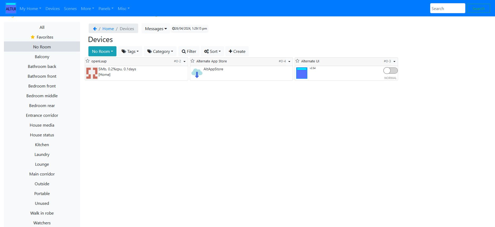
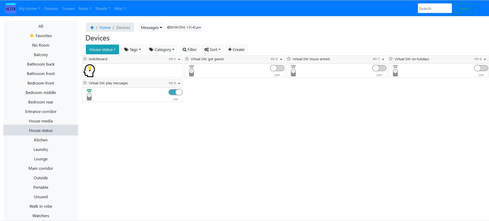

# Alternative User Interface - AltUI
AltUI allows the user to configure and control openLuup or a Vera:

## AltUI after openLuup install
Here is openluup, as seen in AltUI, after a first time install. Rooms have been added for demonstration purposes.

## AltUI and virtual switches
The `Switchboard` plugin is controlling various house modes and status with virtual switches.

## AltUI and timed scenes
An example of various time triggered scenes that have been set up using AltUI.

## AltUI - media control using a BroadLink IR devices
A BroadLink 'RM4 Mini' and 'RM4 Mini S' driven by the Virtual Pronto Remote for IR control in AltUI.

## AltUI - media scenes
Scenes for controlling media devices using AltUI.

## AltUI - BroadLink 'RM4 Mini S' sensors
The BroadLink 'RM4 Mini S' temperature and humidity sensors in AltUI.

