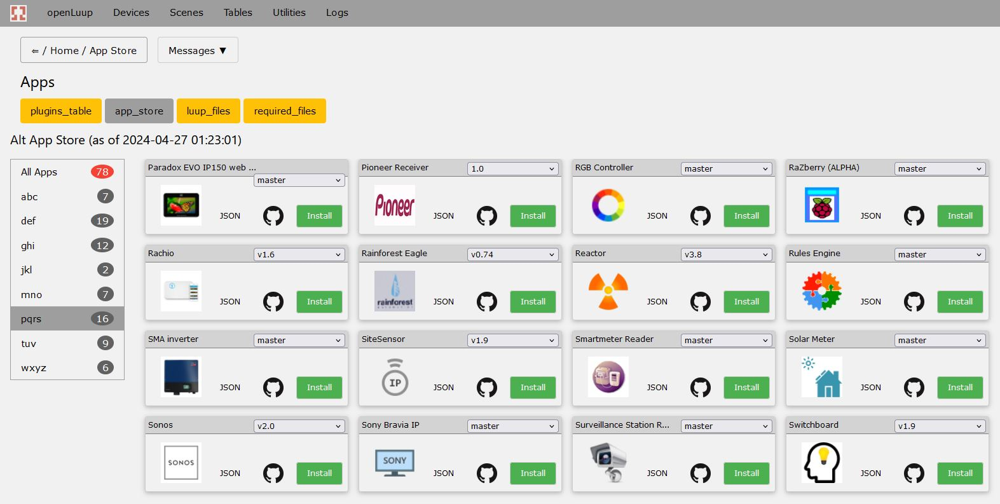

The plugins listed here are available via the Alternative App Store. The app store becomes accessible via a new menu item in the Alternative User Interface once configured.

Both the Alternative User Interface (AltUI) and AltAppStore (AltAppStore) plugins need to be installed on Vera to access the store. With openLuup; this is all "automatically" set up and ready to go as part of the openLuup suite.

The Alternative App Store can be found [here](https://github.com/akbooer/AltAppStore).

Publishing a plugin in the store is pretty easy. First your plugin code must be available in GitHub. Publish it, using the Publish command in the AltAppStore web page. You need to enter the salient information and it's ready to go.

Plugin icons can be stored on GitHub eg [like so](https://github.com/a-lurker/a-lurker.github.io/tree/master/icons). After a "few days" the raw json describing the plugin appears [here](https://raw.githubusercontent.com/akbooer/AltAppStore/data/J_AltAppStore.json).

Vera 3 users should note the store will not work, as Vera 3 doesn't have the https capability required to access GitHub. However, the apps can always be downloaded from GitHub and manually installed.

For those just interested in what the store contains; refer to the list below - as of 2021 July 27 there were about 75 plugins available:

|Plugin|Comments|
|---|---|
|ABC:||
|[Aeratron fans](https://github.com/a-lurker/Vera-Plugin-Aeratron)||
|Alternative App Store|Built into openLuup|
|[ALTHue](https://github.com/amg0/ALTHue)||
|[ALTUI](https://github.com/amg0/ALTUI)||
|[Amcrest Dahua](https://github.com/rafale77/Amcrest-Dahua-Openluup)||
|[AutoVirtualThermostat](https://github.com/toggledbits/AutoVirtualThermostat)||
|[BroadLink-Mk2](https://github.com/a-lurker/Vera-Plugin-BroadLink-Mk2)||
|Canal Plus|Not in GitHub|
|[Countdown Timer](https://github.com/rafale77/MiOS-CountdownTimer)|Originated by Futzle|
|DEF:||
|[DALI Planet](https://github.com/a-lurker/Vera-Plugin-DALI-Planet)||
|[DarkSky Weather](https://github.com/reneboer/DarkSkyWeather)|Support for the Dark Sky API ended 31 Mar 2023. The "Multi Provider Weather Station" plugin can potentially be used as a replacement.|
|[DataYours](https://github.com/akbooer/DataYours)||
|[DelayLight](https://github.com/toggledbits/DelayLight)||
|[DeusExMachinaII](https://github.com/toggledbits/DeusExMachina)||
|[Domoticz Bridge](https://github.com/999LV/DomoticzBridge)|Non functional: needs work [check here](https://smarthome.community/topic/301/domoticz-bridge)|
|[Domoticz Bridge 2](https://github.com/perhusaas/DomoticzBridge)|Originated by 999LV and updated by perhusaas|
|[DreamColorESP8266](https://github.com/GreatGazoe/DreamColorESPVeraPlugIn)||
|[DreamColorLedRGB](https://github.com/GreatGazoe/DreamColorLEDRGB)||
|[Ecobee](https://github.com/rafale77/vera-ecobee)||
|[Edisio Gateway](https://github.com/vosmont/Vera-Plugin-EdisioGateway)||
|[EDS One Wire Server](https://github.com/a-lurker/Vera-Plugin-EDS-One-Wire-Server)|Originated by Chris Jackson|
|[EKM metering](https://github.com/a-lurker/Vera-Plugin-EKM-metering)||
|[Emby Interface](https://github.com/toggledbits/Emby)||
|[Enphase Envoy Solar Monitor](https://github.com/reneboer/Vera-Enphase-Envoy)||
|[EventWatcher](https://github.com/akbooer/EventWatcher)||
|[Ezlo Bridge](https://github.com/reneboer/EzloBridge)||
|[FritzBox Sensor](https://github.com/reneboer/vera-FritzBoxSensor)||
|GHI:||
|[Google Calendar 3](https://github.com/stuartofmt/GCal3)||
|[Harmony Hub Control](https://github.com/reneboer/vera-Harmony-Hub)||
|[Heliotrope](https://github.com/a-lurker/Vera-Plugin-Heliotrope)|Originated by Futzle. openLuup incorporates the same functionality, so this plugin is not required in that casse.|
|[Homebridge 2 openLuup](https://github.com/ronluna/homebridge2openluup)||
|[HomeWave Push](https://github.com/intveltr/HomeWavePush)||
|[HundredGraphs Logger](https://github.com/ipstas/ipstas-vera-hundredgraphs)||
|[IKEA Tradfri](https://github.com/vwout/vera-tradfri)||
|[Image Map Remote](https://github.com/a-lurker/Vera-Plugin-Image-Map-Remote)||
|[Info Viewer](Vera-Plugin-Info-Viewer)|**For Vera only**|
|[IPhone Locator](https://github.com/amg0/IPhoneLocator)||
|[IPX800](https://github.com/amg0/IPX800)||
|[Irrigation Caddy](https://github.com/a-lurker/Vera-Plugin-Irrigation-Caddy)||
|JKL:||
|[KSenia Lares 16 Bridge](https://github.com/amg0/Ksenia)||
|[LuaView](https://github.com/toggledbits/LuaView)||
|MNO:||
|[MetOffice DataPoint](https://github.com/akbooer/MetOffice_DataPoint)||
|[Multi Provider Weather Station](https://github.com/reneboer/MultiStationWeather)||
|[Netatmo](https://github.com/akbooer/Netatmo)||
|[Network Monitor](https://github.com/amg0/NetMonitor)||
|[OpenSprinkler](https://github.com/dbochicchio/vera-OpenSprinkler)||
|[OpenTherm Gateway](https://github.com/reneboer/vera-OpenThermGateway)||
|[openWeather](https://github.com/999LV/openWeather-plugin-for-openLuup)|Support for the Wunderground weather API ended Dec, 2018. The "Multi Provider Weather Station" plugin can potentially be used as a replacement.|
|PQRS:||
|[Paradox EVO IP150 web page scrapper](https://github.com/a-lurker/Vera-Plugin-Paradox-IP150-wps)||
|[Pioneer Receiver](https://github.com/rafale77/vera-pioneer)||
|[Rachio](https://github.com/toggledbits/RachioService)||
|[Rainforest Eagle](https://github.com/jswim788/rainforest-eagle-vera)|Based on robertmm's work|
|[RaZberry (ALPHA)](https://github.com/amg0/razberry-altui)||
|[Reactor](https://github.com/toggledbits/Reactor)||
|[RGB Controller](https://github.com/vosmont/Vera-Plugin-RGBController)||
|[Rules Engine](https://github.com/vosmont/Vera-Plugin-RulesEngine)||
|[SiteSensor](https://github.com/toggledbits/SiteSensor)||
|[SMA inverter](https://github.com/a-lurker/Vera-Plugin-SMA-inverter)||
|[Smartmeter Reader](https://github.com/reneboer/Vera-Dutch-Smartmeter)||
|[Solar Meter](https://github.com/reneboer/vera-SolarMeter)||
|[Sonos](https://github.com/toggledbits/Sonos-Vera)|Originated by lolomodo and updated by toggledbits.|
|[Sony Bravia IP](https://github.com/a-lurker/Vera-Plugin-Sony-Bravia-IP)||
|[Surveillance Station Remote (BETA)](https://github.com/vosmont/Vera-Plugin-SurveillanceStationRemote)||
|[Switchboard](https://github.com/toggledbits/Switchboard-Vera)||
|TUV:||
|[Telegram](https://github.com/dbochicchio/vera-Telegram)||
|[Tesla Car](https://github.com/reneboer/vera-TeslaCar)||
|[UPS Sensor](https://github.com/reneboer/vera-UPSSensor)||
|[UPnP Event Proxy](https://github.com/a-lurker/Vera-Plugin-UPnP-Event-Proxy)|**Modified for installs that have systemd available. Not suitable for Vera** - plugin originated by Futzle. Uses LXP (xml parser), so may need to install it: sudo apt install lua-expat|
|[VeraAlexa](https://github.com/dbochicchio/VeraAlexa)||
|[Virtual Devices](https://github.com/dbochicchio/vera-VirtualDevices)|MQTT commands & status are only available with openLuup. http & Lua can be used by Vera and openLuup.|
|[Virtual Pronto Remote](https://github.com/a-lurker/Vera-Plugin-Virtual-Pronto-Remote)||
|[Virtual Sensor](https://github.com/toggledbits/VirtualSensor)||
|[VW CarNet](https://github.com/reneboer/openLuup-CarNet)||
|WXYZ:||
|[WES](https://github.com/amg0/WES)||
|[Xee](https://github.com/vosmont/Vera-Plugin-Xee)||
|[Yamaha RX HTTP](https://github.com/a-lurker/Vera-Plugin-Yamaha-RX-HTTP)||
|[Z-Way](https://github.com/akbooer/Z-Way)||
|[ZiBlue Gateway](https://github.com/vosmont/Vera-Plugin-ZiBlueGateway)||
|[ZiGate Gateway](https://github.com/vosmont/Vera-Plugin-ZiGateGateway)

Example of plugins in the

