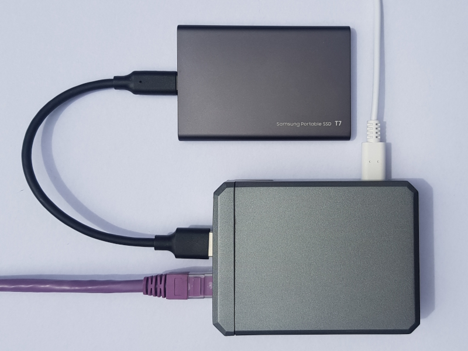
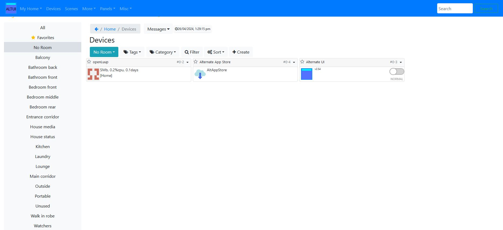
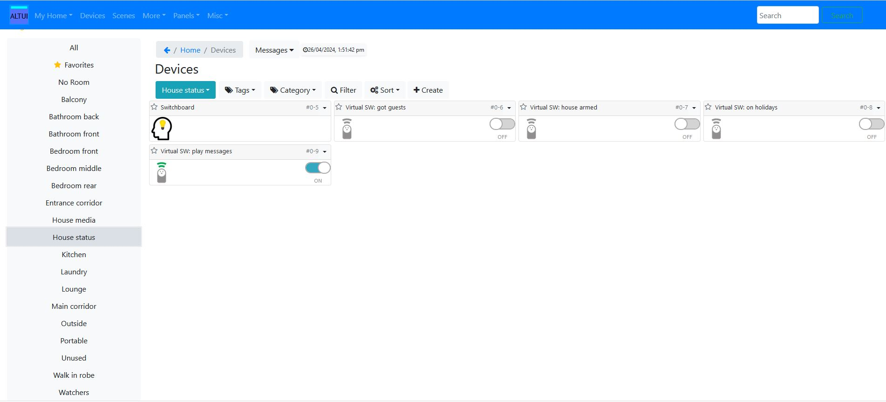

# Quick start with a Raspberry Pi

Here's your brand new shiny Rasberry Pi 4 Model B set up with the latest Rasbian, such as bookworm.



## Install prerequisites
Execute the following using Putty or similar.

```bash
sudo apt update
sudo apt upgrade
sudo apt install lua-socket
sudo apt install lua-filesystem
sudo apt install lua-sec
```

## openLuup Installation
Installation is straight-forward but note you may need to prefix the following commands with sudo: Create a directory **cmh-ludl/** for the openLuup installation on your machine. In your home directory is a good place, or for compatibility with Vera use **/etc/cmh-ludl/** but be careful with permissions (octal 0755).

```bash
sudo mkdir /etc/cmh-ludl
cd /etc/cmh-ludl
```
**cd** to it, and retrieve the install file **openLuup_install.lua** from the GitHub repository using:

```bash
sudo wget https://github.com/akbooer/openLuup/raw/master/Utilities/openLuup_install.lua
```

**openLuup_install.lua** will now be available in the **cmh-ludl/** directory. Run the file using the command line:

```bash
sudo lua5.1 openLuup_install.lua
```

When successful, the script produces console output similar to this:

```text
akbooer@openLuup4:/etc/cmh-ludl $ sudo lua5.1 openLuup_install.lua
openLuup_install   2019.02.15   @akbooer
getting openLuup version tar file from GitHub branch master...
un-zipping download files...
getting dkjson.lua...
creating required files and folders
initialising...
downloading and installing AltUI...
  % Total    % Received % Xferd  Average Speed   Time    Time     Time  Current
                                 Dload  Upload   Total   Spent    Left  Speed
100 29926  100 29926    0     0  64665      0 --:--:-- --:--:-- --:--:-- 64774
  % Total    % Received % Xferd  Average Speed   Time    Time     Time  Current
                                 Dload  Upload   Total   Spent    Left  Speed
100  6570  100  6570    0     0  15410      0 --:--:-- --:--:-- --:--:-- 15386
Sat Apr 20 13:44:38 2024        device 2 '    openLuup' requesting reload
openLuup downloaded, installed, and running...
visit http://172.16.42.131:3480 to start using the system
```

and browsing the **reported URL** http://172.16.42.131:3480 will take you to the AltUI interface and show two devices: openLuup and AltUI. From here on, the interface can be used to configure the system.

Access the console at: http://172.16.42.131:3480/console

That's it!!

## Persist openLuup
Setup a systemd service to start up openLuup at boot time. Refer to the following.

[systemctl](/openluup?id=systemctl-with-etcsystemdsystemopenluupservice)

### File privileges
This file if used, needs to be executable:
```bash
# 0644 ➔ 0755
sudo chmod +x /etc/cmh-ludl/openLuup_reload
```

## json encoders / decoders
You can optimise the json decoding, if needed. Refer to [json parser](openluup-and-json.md).

## Other popular libraries
Some plugins, such as the `UPnP Event Proxy`, require a xml parser. Use the [lxp expat library](https://lunarmodules.github.io/luaexpat/index.html):
```bash
sudo apt install lua-expat
```

## Not working?
Look for clues in the logging/journal:
```bash
journalctl -e
```

Alternatively post your challenge to the [Smarthome Community Forum](https://smarthome.community/)!

## WinSCP
The latest RasPi OS releases don't set up a root login. But you can set up WinSCP so it has root priviledges:

In WinSCP:
Select Site and Edit then select Advanced and navigate to Environment > SCP/Shell

In the Shell pull down list: change from 'Default' to 'sudo su -' and save. Your account will log in using sudo privileges, letting you SCP files anywhere as root. This needs to be done per site you log into.

# Alternative User Interface - AltUI
AltUI allows the user to configure and control openLuup or a Vera:

## AltUI after openLuup install
Here is openluup, as seen in AltUI, after a first time install. Rooms have been added for demonstration purposes.



## AltUI and virtual switches
The `Switchboard` plugin is controlling various house modes and status with virtual switches.



## AltUI and scenes
An example of various time triggered scenes that have been set using AltUI.


